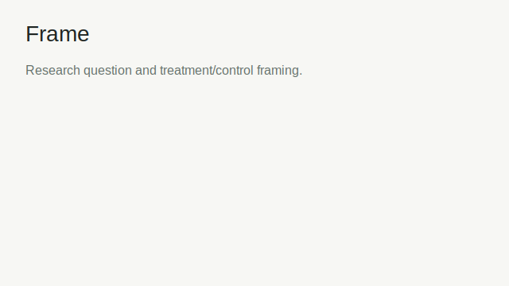
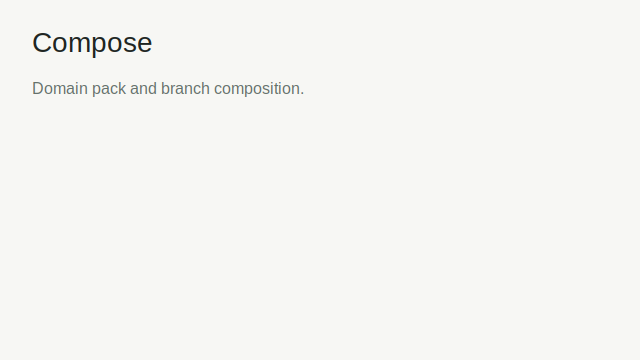
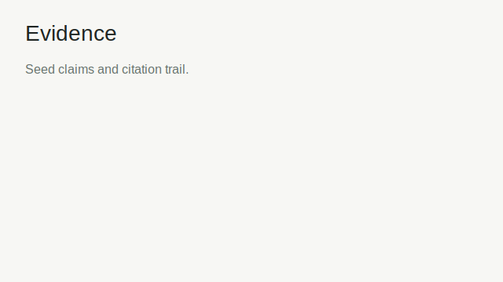
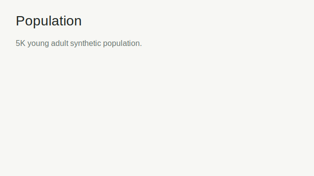
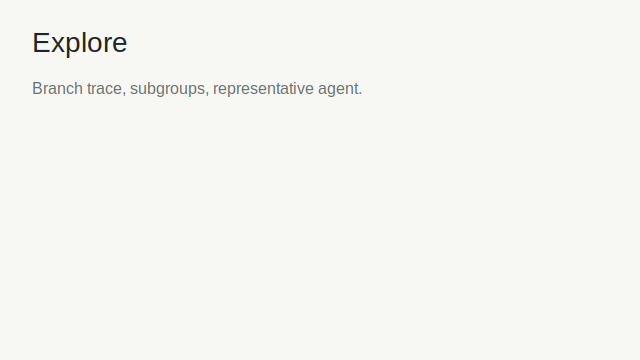
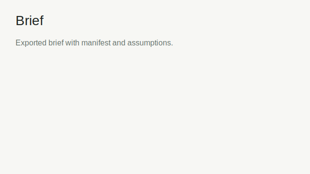

# Young Adult Flourishing Futures Smoke Walkthrough

Scenario: 5,000 young adult agents, 60-month horizon, 30 seeds, treatment versus control.

## Checklist

- [x] Frame: define the treatment/control research question.
  
- [x] Compose: select the flourishing pack and branch setup.
  
- [x] Evidence: attach seed evidence claims.
  
- [x] Population: inspect the 5K-agent synthetic population.
  
- [x] Configure: save a 60-month, 30-seed run spec.
  
- [x] Execute: run the saved spec and stream progress.
  
- [x] Validate: record E-values, fidelity, seed variance, and drift.
  
- [x] Controlled re-entry: re-enter from Validate to Frame, regenerate downstream artifacts, and proceed forward.
- [x] Explore: inspect branch attribution and representative agents.
  
- [x] Brief: export a fresh brief with findings, assumptions, uncertainty, evidence, validation status, and reproducibility manifest.
  

## Validation Result

The smoke run preserves the validation result as observed. The mentoring/meaning claim remains red in the fixture-backed validation payload, so the brief records a cautious epistemic mode and the reason in assumptions.

## Performance

Profile committed at `docs/perf/ya-smoke-2026-04-26.svg`. The smoke harness is under budget, so no hotspot fix was applied.

## Advisor Sign-Off

Status: pending external advisor approval.

Required sign-off text to attach before final acceptance:

> I reviewed the Young Adult Flourishing Futures smoke brief, including findings, validation status, uncertainty, assumptions, and reproducibility manifest, and approve it as an MVP smoke artifact.
